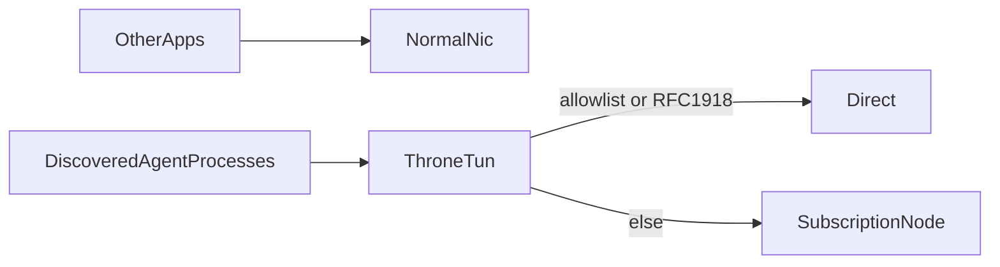

# Throne: только локальные агенты через VPN

Публичный skill для агентов: на Windows ставит/настраивает [Throne](https://throneproj.github.io) так, чтобы **через подписку/VPN шёл только трафик локальных агентских клиентов** — Cursor IDE/Agent, Claude Code/Desktop, Codex CLI/App, Devin CLI/Desktop (и path-qualified Windsurf language server). Остальной трафик ОС (браузер, другие приложения, корпоративный канал при наличии) идёт как обычно.

Имя skill: `throne-agents-tun`. Заменяет `throne-cursor-only-public` (см. [docs/MIGRATION.md](docs/MIGRATION.md)).

Файлы агента: [`SKILL.md`](SKILL.md), [`reference.md`](reference.md). Архитектура: [`docs/tun-process-routing.md`](docs/tun-process-routing.md). Сети вендоров: [`docs/agent-network-requirements.md`](docs/agent-network-requirements.md). Подводные камни: [`docs/pitfalls.md`](docs/pitfalls.md). Fallback без TUN (только Cursor IDE): [`docs/http-proxy-fallback.md`](docs/http-proxy-fallback.md). Cloud smoke: [`docs/cloud-smoke-test.md`](docs/cloud-smoke-test.md).

## Что сказать агенту

Пример промпта:

> Настрой VPN только для локальных агентов по skill `throne-agents-tun`. Клиенты: Cursor, Claude Code/Desktop, Codex CLI/App, Devin CLI/Desktop. Allowlist внутренних DNS/доменов: \<вставить\>. Ссылку подписки в чат не присылаю — вставлю в UI Throne сам (`Ctrl+V`). Живой Throne на этой машине не трогай.

Нужно от пользователя:

1. **Allowlist** суффиксов/хостов/CIDR, которые должны остаться direct (корпоративный DNS / локальная сеть).
2. Подписку — только в окно Throne, не в чат/git/skill.
3. Подтверждение, какие из четырёх семейств реально установлены.

Агент **не выдумывает** домены и не читает PAC с диска, пока список не прислали в этот чат. Агент **не** глушит Throne/TUN, если текущая сессия уже от него зависит.

## Матрица покрытия

| Клиент | Профиль Agents only | Комментарий |
|--------|---------------------|-------------|
| Cursor IDE + cursor-agent | TUN process split | Chat/Agent часто внутри `Cursor.exe` |
| Claude Code + Claude Desktop | TUN process split | CLI и Desktop — разные пути `claude.exe` / `Claude.exe` |
| Codex CLI + Codex App | TUN process split | App может быть `ChatGPT.exe` только под `OpenAI.Codex` |
| Devin CLI | TUN process split | `devin.exe` under `.local\\bin` or `cognition\\cli` |
| Devin Desktop + Windsurf LS | TUN process split | Path-qualified `Devin\\Devin.exe`, bundled CLI, `language_server_windows_x64.exe` under `extensions\\windsurf\\bin` only |
| Devin Cloud / Devbox | вне skill | Не TUN рабочей станции |

Публичный egress совпавшего процесса (Git, MCP, пакеты) тоже уходит в туннель. Внутренние имена — только через подтверждённый allowlist.



## Быстрый порядок

1. Portable ZIP Throne → `<THRONE_DIR>/Throne.exe`.
2. Импорт подписки в UI → Refresh.
3. `scripts/discover_agent_processes.ps1` → `scripts/render_agents_only_rules.py`.
4. Профиль **Agents only** (default outbound = direct; в proxy только discovered processes + path/regex).
5. Allowlist **выше** process-правил.
6. Запуск **от администратора** → нода → **TUN on**, **System Proxy off**.
7. Логи: агенты → `socks[proxy]`; прочие приложения → `direct`; allowlist/RFC1918 → `direct`.
8. UI: автозапуск с Windows (elevated Task Scheduler) + **Remember last profile** + автообновление подписки **каждые 30 минут**. Без Remember после ребута GUI админский, но нода и TUN выключены. После первого успешного узла — **либо** `scripts/register_autostart_flags_task.ps1 -ThroneDir $env:THRONE_DIR -Python <python.exe>`, **либо** elevated `scripts/rebind_throne_startup_task.ps1` с тем же `-Python` (не оба после успешного rebind). Не WindowsApps-заглушку python.

## Сосуществование с другим VPN / корпоративной сетью

Проксируются выбранные процессы, не вся ОС. Имена intranet/SSO в allowlist → `direct`. Без allowlist агент утащит их на датацентровый IP → типичны timeout / WAF 403.

## Portable и смена машины

Throne Portable ZIP ставится в любой каталог (`<THRONE_DIR>`). Пути process-правил **локальны для машины**: после копирования каталога или обновления клиента заново снять discovery. Allowlist тоже уточнять на месте. TUN по-прежнему требует прав администратора.

## Если нет прав на TUN

Не включать System Proxy (WinINET на всю ОС). Для **Cursor IDE** есть app-level `http.proxy` на mixed inbound. Это **не** покрывает Claude/Codex/Devin/`cursor-agent`. См. [`docs/http-proxy-fallback.md`](docs/http-proxy-fallback.md).

## Проверки

Hermetic (любая машина, без живого TUN):

```text
python scripts/validate_skill.py
python -m pytest tests -q
```

`windows-latest` CI YAML лежит в [`docs/github-actions-validate-skill.yml`](docs/github-actions-validate-skill.yml). В `.github/workflows/` его не пушил GitHub OAuth без scope `workflow` — скопируйте вручную, пока CI не станет gate. До этого pre-release = локальный pytest + smoke на disposable VM.

Динамический smoke — только disposable Windows VM / cloud: [`docs/cloud-smoke-test.md`](docs/cloud-smoke-test.md). Не гонять против Throne, через который уже ходит этот агент.

## Чего skill намеренно не делает

- Не публикует URL подписок и чужие внутренние домены.
- Не рекомендует System Proxy как способ «просто проверить».
- Не обходит политики доступа / WAF / SSO подменой клиента.
- Не маршрутизирует Devin Cloud с рабочей станции.
